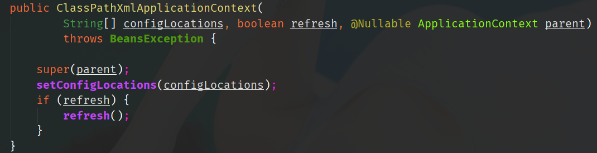
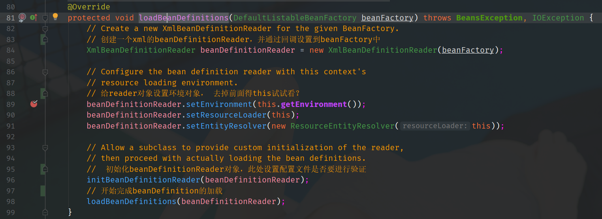
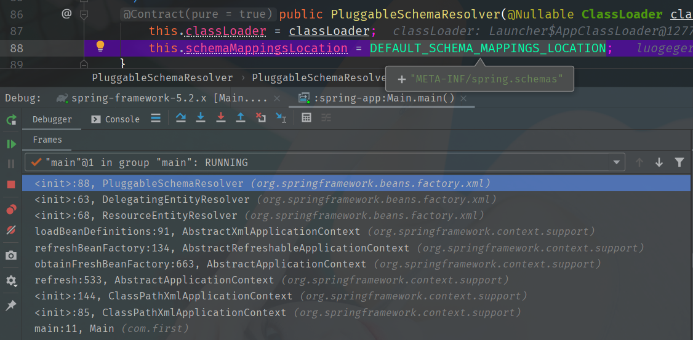
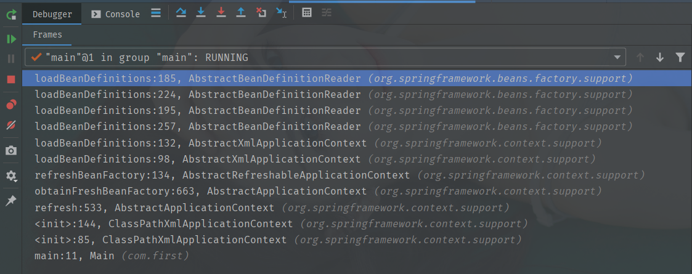

- 自定义XML标签
  - xsd:schemas
  - handlers: 命名空间，org.springframework.beans.factory.xml.DefaultBeanDefinitionDocumentReader.parseBeanDefinitions
  - 标签属性

- 读取配置文件
  - 
- 创建工厂BeanFactory
- 创建BeanDefinitionReader, 并且设置BeanFactory
  - 
  - 
  - 

